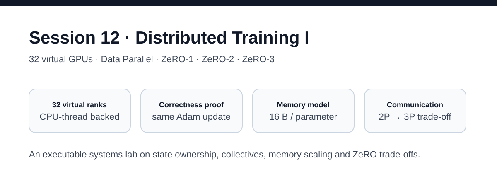
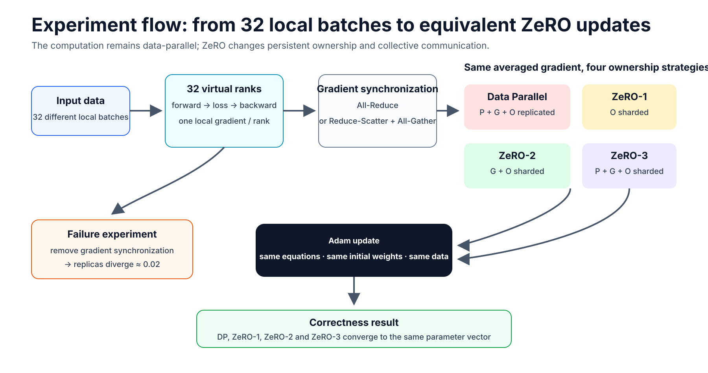
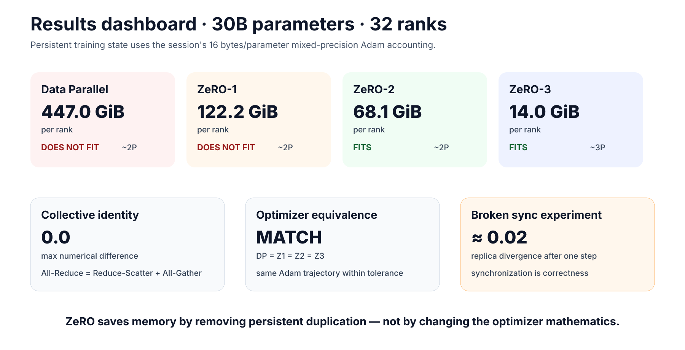
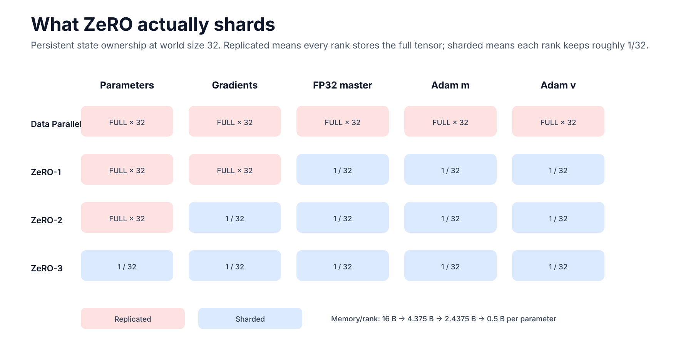
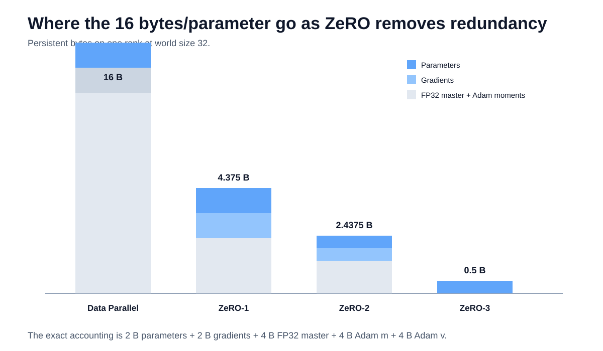
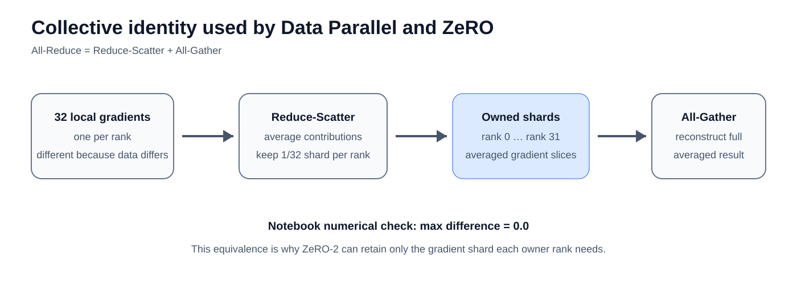
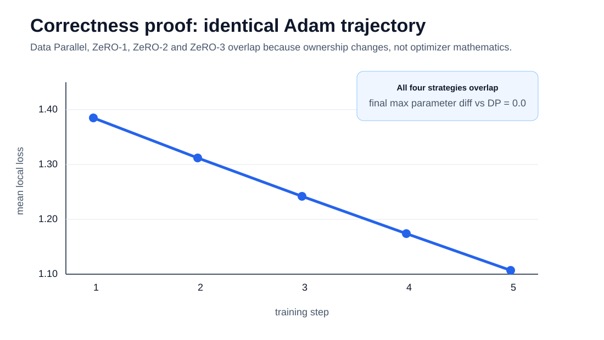
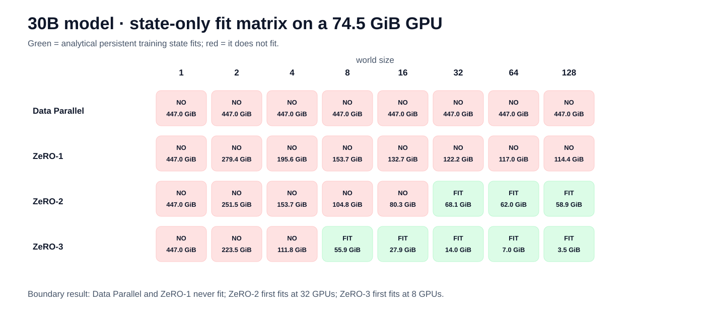
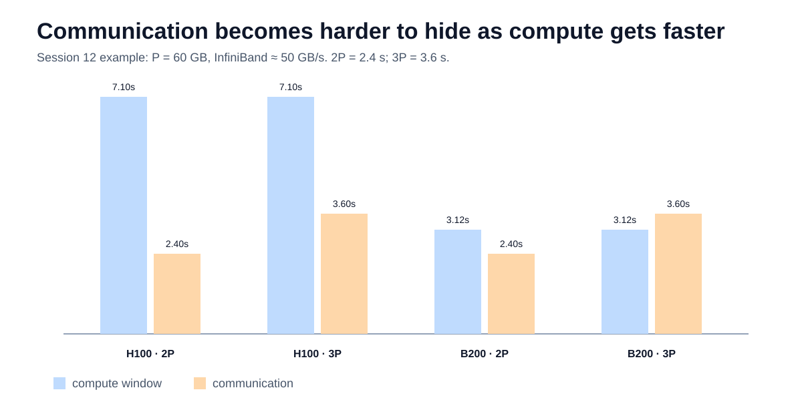
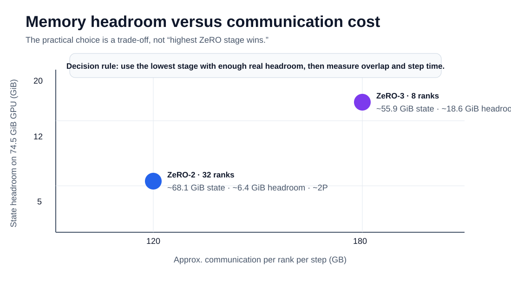

# Session 12 — Distributed Training I: Data Parallel & ZeRO

> **32 virtual GPUs · executable PyTorch simulation · Data Parallel · ZeRO-1 · ZeRO-2 · ZeRO-3**



This assignment is an executable experiment in **distributed-training state ownership**. I use 32 virtual ranks to show how Data Parallel, ZeRO-1, ZeRO-2 and ZeRO-3 change memory, communication and optimizer ownership while preserving the same Adam update.

**Notebook:** [session12_zero_32_virtual_gpus.ipynb](./session12_zero_32_virtual_gpus.ipynb)

---

## 1. Experiment architecture



The important distinction is that **ZeRO is not tensor parallelism**. Each rank still processes a different local batch. ZeRO progressively changes which rank permanently owns parameters, gradients and optimizer state.

The notebook also contains a deliberate failure path: I remove gradient synchronization for one step and show that the replicas diverge. That makes synchronization part of the correctness argument rather than a networking detail.

---

## 2. Headline results



For the Session 12 **30B parameter model**, using the lesson's mixed-precision Adam accounting of **16 bytes per parameter**:

| Strategy | State / rank at 32 GPUs | Fits 74.5 GiB? | Approx. communication |
|---|---:|:---:|---:|
| Data Parallel | **447.0 GiB** | No | ~2P |
| ZeRO-1 | **122.2 GiB** | No | ~2P |
| ZeRO-2 | **68.1 GiB** | **Yes** | ~2P |
| ZeRO-3 | **14.0 GiB** | **Yes** | ~3P |

`P` is one full 16-bit parameter copy. For a 30B model, `P = 60 GB`.

---

## 3. What each ZeRO stage actually shards



The state model is:

| State | Bytes / parameter |
|---|---:|
| FP16 parameter | 2 |
| FP16 gradient | 2 |
| FP32 master parameter | 4 |
| Adam first moment | 4 |
| Adam second moment | 4 |
| **Total** | **16** |

At world size `N`:

- **Data Parallel:** `16`
- **ZeRO-1:** `4 + 12/N`
- **ZeRO-2:** `2 + 14/N`
- **ZeRO-3:** `16/N`



My mental model is simple: **ZeRO removes one class of persistent redundancy at a time.**

---

## 4. The 32 virtual GPU experiment


The notebook launches **32 CPU worker threads**, one per virtual GPU/rank. Every rank receives a different local batch and computes a real PyTorch autograd gradient.

Before using those gradients in the ZeRO simulation, I compare the threaded result with a deterministic sequential reference. The maximum difference is **0.0** in the experiment.

---

## 5. Why ZeRO-2 is mathematically valid

ZeRO-2 depends on the collective identity:

**All-Reduce = Reduce-Scatter + All-Gather**



The notebook verifies it numerically:

```text
max |all-reduce - (reduce-scatter + all-gather)| = 0.0
```

This is the key reason ZeRO-2 can keep only the averaged gradient shard needed by each owner rank without changing the global gradient.

---

## 6. Optimizer correctness proof

All four strategies start from the same parameters, consume the same 32 local batches and use the same Adam equations.



After multiple optimizer steps, **Data Parallel, ZeRO-1, ZeRO-2 and ZeRO-3 end at the same parameter vector within experiment tolerance**.

> **Ownership changes. The optimizer mathematics does not.**

I also run a negative-control experiment: if each replica applies only its local gradient, the replicas diverge by roughly **0.02 after one step**. That is evidence that collective synchronization is required for correctness.

---

## 7. The 30B memory wall



The analytical state-only fit boundary on a **74.5 GiB GPU** is:

| Strategy | First power-of-two world size that fits |
|---|---:|
| Data Parallel | Never |
| ZeRO-1 | Never |
| ZeRO-2 | **32 GPUs** |
| ZeRO-3 | **8 GPUs** |

This reveals the memory floor of each stage:

- **Data Parallel:** full 16 B/parameter remains replicated.
- **ZeRO-1:** parameters + gradients remain replicated → 4 B/parameter floor.
- **ZeRO-2:** parameters remain replicated → 2 B/parameter floor.
- **ZeRO-3:** all persistent model state is sharded in this simplified model.

---

## 8. Memory saving versus communication



Using the Session 12 assumptions:

- Data Parallel / ZeRO-1 / ZeRO-2 ≈ **2P** per step.
- ZeRO-3 ≈ **3P** per step.
- H100 example compute ≈ **7.10 s**.
- B200 example compute ≈ **3.12 s**.

The network volume does not become smaller just because the GPU becomes faster. Faster compute means a shorter window in which communication can be hidden.



For the two practical lesson candidates:

| Candidate | State / rank | GPU headroom | Communication |
|---|---:|---:|---:|
| ZeRO-2 · 32 ranks | ~68.1 GiB | ~6.4 GiB | ~2P |
| ZeRO-3 · 8 ranks | ~55.9 GiB | ~18.6 GiB | ~3P |

### My decision rule

> **Use the lowest ZeRO stage that gives enough real memory headroom, then measure communication overlap and actual step time on the target hardware.**

---

## 9. What I understood

The three ZeRO stages are easiest for me to remember as three redundancy questions:

1. **ZeRO-1:** Why should every rank keep identical optimizer history?
2. **ZeRO-2:** Why should every rank keep the complete averaged gradient after synchronization?
3. **ZeRO-3:** Why should every rank keep the entire parameter set resident between operations?

At 32 ranks, the cluster-wide persistent-state redundancy becomes:

| Strategy | Cluster-wide redundancy |
|---|---:|
| Data Parallel | **32.0×** |
| ZeRO-1 | **8.75×** |
| ZeRO-2 | **4.875×** |
| ZeRO-3 | **1.0×** |

That is the most literal meaning of **Zero Redundancy Optimizer** in this experiment.

---

## 10. Run the assignment

```bash
python -m venv .venv
source .venv/bin/activate          # Windows: .venv\Scripts\activate
pip install -r requirements.txt
jupyter lab session12_zero_32_virtual_gpus.ipynb
```

Run the tests:

```bash
python -m pytest -q
```

The project is CPU-friendly and can also be executed in Google Colab.

---

## Repository structure

```text
.
├── session12_zero_32_virtual_gpus.ipynb
├── assets/                         # all rendered diagrams and result charts
├── src/
│   ├── zero_sim.py                 # DP / ZeRO simulator
│   └── visuals.py                  # reproducible plotting code
├── tests/
│   ├── test_zero_sim.py
│   └── test_visuals.py
├── pytest.ini
├── requirements.txt
└── README.md
```

---

## Scope and limitations

This is an **educational state-and-collective simulator**, not a replacement for DeepSpeed or PyTorch FSDP.

- The local-gradient experiment uses 32 actual CPU worker threads; the core state simulator uses deterministic rank orchestration so results are reproducible.
- The toy ZeRO-3 path materializes the tiny demo model for clarity. Production implementations gather parameters layer-by-layer and prefetch/release them.
- The memory numbers use the lesson's analytical `16 B/parameter` training-state model; Python object overhead is not treated as GPU memory.
- Activation memory is intentionally separated from persistent parameter/gradient/optimizer state.
- Communication figures are volume/bandwidth models, not full NCCL topology or overlap traces.

---

## Visual index

All images below are generated artifacts stored in `assets/` and committed with the repository.

- [Project cover](./assets/00_project_cover.svg)
- [Experiment architecture](./assets/01_experiment_architecture.svg)
- [State ownership diagram](./assets/02_state_ownership.svg)
- [Results dashboard](./assets/03_results_dashboard.svg)
- [32 virtual ranks](./assets/01_virtual_cluster.svg)
- [Collective flow](./assets/02_collective_flow.svg)
- [Memory composition](./assets/04_memory_composition.svg)
- [30B fit matrix](./assets/05_fit_matrix.svg)
- [Communication pressure](./assets/06_communication_pressure.svg)
- [Memory/communication decision map](./assets/07_decision_map.svg)
- [Adam correctness trajectory](./assets/08_correctness_trajectory.svg)
